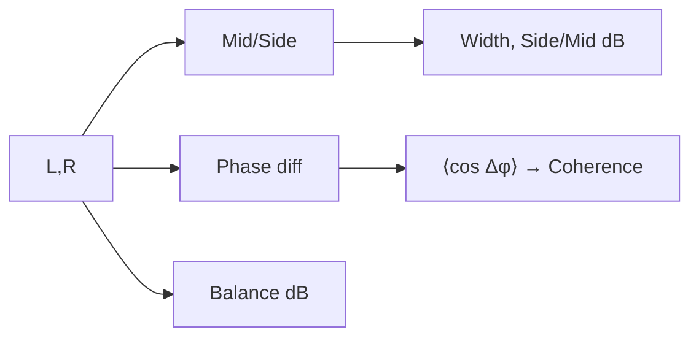

# AI DJ with Model

AI DJ with Model is a small toolkit for analysing music files, training a song recommender, and exploring the results in a Streamlit-powered virtual DJ interface inspired by the DDJ-FLX4 controller. The workflow starts by extracting rich audio features from your library, continues with model training, and ends with an interactive browser app that can recommend follow-up tracks and render simple transitions.

## Highlights
- End-to-end pipeline: audio feature extraction, model training, and live interface.
- Rich musical descriptors (rhythm, tonal, dynamics, mood, instrumentation, embeddings).
- Optional power-ups when Essentia, madmom, pyloudnorm, OpenL3, or Spleeter are installed.
- Recommender bundle saved as `models/recommender.joblib` for reuse in the UI.
- Streamlit front end with two compact decks, central mix controls, and instant mix preview.

## Repository Layout
- `feauture_extraction.py` – CLI and library for generating detailed JSON reports from audio files.
- `train_recommender.py` – trains the scaler, nearest-neighbor model, and clustering on saved reports.
- `dj_interface.py` – Streamlit application that loads the bundle plus analysis reports.
- `models/recommender.joblib` – example trained bundle (regenerate by running the training script).
- `tests/` – unit tests for the feature extraction helpers.
- `Music_Data/` (optional) – expected location for your music library if you use defaults.

## Requirements
- Python 3.9+
- Required packages: `numpy`, `librosa`, `pandas`, `joblib`, `scikit-learn`, `streamlit`, `soundfile`, `pydub`
- Optional packages (enable extra features): `pyloudnorm`, `openl3`, `essentia`, `madmom`, `spleeter`
- FFmpeg installed on your PATH (recommended for pydub MP3 export).

You can install the basics with:

```bash
pip install numpy librosa pandas joblib scikit-learn streamlit soundfile pydub mutagen
```

Add any of the optional libraries above if you plan to use their specific capabilities.

## Quick Start
1. **Clone and enter the project**
   ```bash
   git clone <repo-url>
   cd AI_DJ_with_model
   ```
2. **Set up a virtual environment (recommended)**
   ```bash
   python -m venv .venv
   source .venv/bin/activate  # On Windows use: .venv\Scripts\activate
   ```
3. **Install dependencies** using the `pip install` command shown above (add optional packages as needed).
4. **Analyse a track** to produce a JSON report (saved next to the audio by default):
   ```bash
   python feauture_extraction.py path/to/song.mp3
   ```
   Add `--output -` if you want the JSON printed to the terminal instead of written to disk.
5. **Train the recommender** on all JSON reports:
   ```bash
   python train_recommender.py --reports reports --model-out models/recommender.joblib
   ```
6. **Launch the Streamlit interface**:
   ```bash
   streamlit run dj_interface.py
   ```
   The app will open in your browser, allowing you to load two decks, configure the mix, and generate a transition.

## Detailed Usage

### 1. Audio Feature Extraction
`feauture_extraction.py` can process individual files or entire folders. Useful flags:

- `--output <path>`: write the analysis to a specific location. Omit the flag to save alongside the audio, or pass `--output -` to print to stdout.
- `--batch-folder <folder>`: analyse every file matching `--batch-pattern` (defaults to `*.mp3`).
- `--batch-pattern "**/*.mp3"`: recursively scan subfolders when running in batch mode.
- `--enable-stems`: run Spleeter stem separation (requires Spleeter and FFmpeg).
- `--embeddings`: compute OpenL3 embeddings if the library is installed.
- `--disable-essentia` or `--disable-madmom`: skip those heavy optional dependencies even if available.
- `--overwrite`: recompute analysis even when the JSON already exists next to the file.

#### Single-file extraction

Generate or refresh analysis for one track (JSON saved alongside the audio):

```bash
python feauture_extraction.py /mnt/nvme/Genie_lib/Music_Data/song.mp3
```

To force a refresh, append `--overwrite`. To keep the output in the console, use `--output -`.

Example batch run that mirrors the defaults used by the Streamlit app:

```bash
python feauture_extraction.py --batch-folder /mnt/nvme/Genie_lib --batch-pattern "**/*.mp3"
```

JSON files will be written next to their source audio. Provide `--batch-out reports` to collect them elsewhere, and add `--overwrite` to refresh existing analyses.
- The quoted `"**/*.mp3"` pattern recursively scans every subfolder beneath the chosen library root so you can point to a top-level music directory.

Each JSON file records metadata, rhythm, tonal, dynamics, spatial, mood, instrumentation, and optional embeddings/stem statistics. The tests in `tests/test_feauture_extraction.py` illustrate the expected structure.

### 2. Training the Recommender
`train_recommender.py` reads every JSON report, flattens the relevant metrics, and trains a bundle with:

- `StandardScaler` for feature normalisation.
- `NearestNeighbors` (cosine distance) for similar-track lookup.
- `KMeans` clustering for organising the library into groups.

Key flags:
- `--reports`: folder containing the JSON files (default `reports`).
- `--model-out`: where to save the joblib bundle (default `models/recommender.joblib`).
- `--neighbors`: how many nearest neighbours to keep.
- `--test-size`: fraction reserved for evaluation metrics (set to `0` or `1` to skip splitting).

Run the script whenever you add new analysis files so the Streamlit app can pick up the updated model.

### 3. Streamlit DJ Interface
Start the UI with `streamlit run dj_interface.py`. Important behaviours:

- The app loads the recommender bundle (default `models/recommender.joblib`) and caches it for quicker reloads.
- It scans the `reports` directory for analysis JSON files and filters them to match `--allowed-folder` values. If no reports are found there, it will search every allowed folder for JSONs stored alongside your audio.
- Deck A and Deck B sit on the left/right columns with quick-pick dropdowns and uploaders, while the mix panel stays centered for a clean single-screen workflow.
- Tracks without a matching JSON analysis are ignored, so make sure you have run the feature extractor on any music you want available in the interface.
- Deck search boxes match on file stem or path; the app prevents using the same track on both decks.
- When `auto_recommend` is enabled (controlled via `instructions.json`), the UI lists nearby tracks from the training metadata.
- The mix renderer prefers pydub + FFmpeg. If unavailable, it falls back to a numpy/librosa crossfade implementation exporting WAV.

#### Instructions JSON
`instructions.json` lets you preconfigure default searches, mix style, crossfade length, effects, and allowed library folders. Update the file and refresh Streamlit to load the new defaults.

## Running Tests
Unit tests cover the most critical feature-extraction utilities. Run them with:

```bash
python -m pytest tests
```

## Tips
- Keep audio and report folders organised; large batch runs can create hundreds of JSON files.
- Optional libraries significantly improve analysis quality (e.g., Essentia for advanced tonal descriptors, madmom for downbeat tracking).
- Re-run the training script whenever you add new reports so the model stays in sync.
- Ensure FFmpeg is installed if you want MP3 export from the Streamlit mix renderer.

Enjoy exploring your music library with AI-assisted analysis and quick virtual mixes!

## Feature Extraction & Audio Analysis (Deep Dive)

This section documents every feature family extracted by `feauture_extraction.py`, including:
- What the feature represents musically and why it matters for DJ workflows.
- How we compute it (methods, transforms, and parameters).
- The mathematical/physical intuition behind the method.
- Which package implements it and why it was chosen.

Where relevant, the JSON output records library availability so downstream code can degrade gracefully when optional packages aren’t present.

### Transformation Map (What → How → Why)
- Core DSP (STFT, spectral stats, tempogram, HPSS, pYIN): `librosa` — mature, well‑documented, pure‑Python, broad coverage.
- Downbeats (optional): `madmom` — strong RNN/DBN trackers for phrasing; great on dance music.
- Tonal/high‑level (optional): `essentia` — optimized C++ algorithms; robust key/chord/mood/genre descriptors.
- Loudness (optional): `pyloudnorm` — faithful ITU‑R BS.1770/EBU R128 implementation.
- Embeddings (optional): `openl3` — widely used deep audio embeddings for similarity.
- Stems (optional): `spleeter` — fast U‑Net separation; quality/speed trade‑off is excellent.

### Rhythm
1) Onset envelope (spectral flux)
- Clap your hands: each clap is a spike; bigger claps make taller spikes.

- Why: Tracks transient/percussive energy; foundation for tempo/beat tracking and energy curves.
- Method: STFT magnitude, frame energy and half‑wave rectified temporal derivative, normalized to [0,1].
- Math:
  - Windowed STFT (discrete): `X[k, m] = Σ_{n=0}^{N-1} x[n + mR] · w[n] · e^{-j 2π k n / N}` where `N` is FFT size, `R` hop, `m` frame.
  - Broadband energy per frame: `E[m] = Σ_k |X[k, m]|` (sum of magnitudes).
  - Spectral flux (rectified derivative): `SF[m] = max(0, E[m] − E[m−1])`; then normalize by `max SF`.
- Physics: Via Parseval’s theorem, power changes in time reflect in spectral magnitudes; transients cause sharp rises in `E[m]`.
- Package: `librosa.stft` (used directly in `_spectral_flux_onset`).

2) Tempo & beats
- Count claps for 15 seconds and multiply by 4 — that’s your BPM.

- Why: BPM and beat grid drive phrasing, alignment, sync, and crossfade timing.
- Method: `librosa.beat.beat_track(onset_envelope=...)` uses periodicity analysis (autocorrelation/comb) and dynamic programming to pick a beat sequence consistent with a tempo hypothesis.
- Math: Autocorrelation of onset envelope `r[τ] = Σ_m O[m] O[m−τ]`; peak lags map to tempo `BPM ≈ 60·sr / (τ·hop)`. DP maximizes a global objective for consistent spacing.
- Notes: Hop length tunes resolution vs. robustness; the app defaults to `hop_length=512`.

3) Tempo variation
- A runner speeds up and slows down — songs can too.

- Why: Detects drift/multiple tempi (live takes, transitions, or genre blends) that complicate sync.
- Method: request non‑aggregated tempo estimates from `librosa.beat.tempo(..., aggregate=None)` and summarize with mean/std/min/max.

4) Polyrhythm candidates
- Tap one hand every 2 beats and the other every 3 — two patterns at once.

- Why: Reveals competing periodicities (e.g., half‑time or triplet feels) influencing phrasing choices.
- Method: tempogram over onset envelope → average strength across time → top tempo peaks and their ratios.
- Math: Tempogram (Fourier or autocorrelation domain) estimates periodic energy vs. tempo. We then find top `k` peaks in `mean_tempogram(tempo)` and compute ratios to the strongest tempo.

5) Swing & micro‑timing
- Say “ONE-and-a TWO-and-a” with the “and” a little longer — that lopsided feel is swing.

- Why: Swinged grooves can clash with straight ones; timing affects perceived tightness.
- Method: from beat times `{t_i}`, compute inter‑beat intervals `Δ_i = t_{i+1} − t_i`. Split even/odd intervals; swing ratio `≈ mean(Δ_odd)/mean(Δ_even)`. Micro‑timing `= std(Δ_i − mean(Δ))`.

6) Danceability (heuristic)
- Does it make you wiggle right away? Songs near 120 BPM often do.

- Why: Coarse proxy for “groove potential” in curation/recommendations.
- Method: Combine a Gaussian preference around ~120 BPM with onset variability: `score = 0.6·exp(-(BPM−120)^2/(2·σ^2)) + 0.4·std(norm_onset)`; clamp to [0,1].

Mermaid: STFT→Onsets→Beat/Tempo/Polyrhythm
```mermaid
flowchart LR
  A[Waveform] --> B[Windowing]
  B --> C[STFT |X(k,m)|]
  C --> D[Frame energy E[m]]
  D --> E[Rectified diff → Onset env]
  E --> F[Autocorr/comb]
  F --> G[Tempo]
  E --> H[Beat tracking (DP)]
  E --> I[Tempogram]
  I --> J[Polyrhythm peaks & ratios]
```

### Tonal & Spectral
1) Chroma (CQT) and Tonnetz
- Piano notes high or low can be the same letter; chroma cares about the letter. Tonnetz is a map of “friendly” note neighbors.

- Why: Pitch‑class content (12‑D) and harmonic relations for harmonic mixing/compatibility.
- Method: Constant‑Q Transform (log‑spaced bins) → fold onto 12 chroma classes; compute Tonnetz (triadic/fifths relationships) from chroma.
- Math: CQT uses constant `Q = f/Δf`, matching equal‑tempered spacing; chroma is a modulo‑12 folding of CQT bins. Tonnetz is a 6‑D embedding where axes represent perfect fifths, major/minor third relations.
- Package: `librosa.feature.chroma_cqt`, `librosa.feature.tonnetz`.

2) Key estimation (Krumhansl‑Schmuckler)
- A song “lives” in a home key, like the C-major neighborhood.

- Why: Harmonic compatibility for key matching and smooth transitions.
- Method: Correlate mean chroma with Krumhansl–Kessler profiles for major/minor under all 12 rotations; pick best with normalized confidence.
- Math: For key `κ` with profile `p_κ` and mean chroma `c̄`, `score(κ) = ⟨p_κ, roll(c̄, κ)⟩`; confidence `= score_max / Σ score`.

3) Chord progression (template matching)
- Like a story: home → adventure → back home (C → F → G → C).

- Why: Triad presence over time highlights hooks/choruses and harmonic movement.
- Method: For each frame, compute scores vs. major/minor triad templates `t_{r,q}` at intervals (root, +4, +7) or (root, +3, +7), pick argmax; segment runs; average confidence gap (best−second).
- Math: `s_{r,q}(m) = t_{r,q}^T · chroma_norm[:, m]`; `argmax` over `(r,q)`; segment when `argmax` changes.

4) Tonal tension & modulation
- Tension is like going up a rollercoaster; modulation is moving to a new musical neighborhood mid-song.

- Why: Captures harmonic motion and perceived tension; identifies modulation points.
- Method: Tension via temporal derivative norm on Tonnetz; modulation via frame‑sampled key estimates.
- Math: With Tonnetz `T ∈ ℝ^{6×M}`, `tension[m] = ∥∂T/∂m∥_2` (approximated by finite differences).

5) Spectral centroid, flatness, zero‑crossing rate
- Cymbals (bright) vs. bass (dark) → centroid; “ssss” (noisy) vs. whistle (pure) → flatness; noisy sounds cross zero more often.

- Why: Timbral brightness (centroid), noisiness/tonality (flatness), and high‑frequency/noise proxy (ZCR); useful for mood/energy.
- Math:
  - Centroid: `C = (Σ_k f_k S[k]) / (Σ_k S[k])` where `S[k]` is magnitude/energy at bin `k`.
  - Flatness: `GF = (∏_k S[k])^{1/K} / ((1/K) Σ_k S[k])` ∈ [0,1]; high = noise‑like.
  - ZCR: fraction of sign changes per frame in `x[n]`.

6) Dissonance (roughness proxy)
- Two whistles almost the same pitch make a buzzy wobble — higher roughness.

- Why: Heuristic correlate with perceived roughness/“noisy density”.
- Method: Combine spectral flatness and spectral contrast; not a full Plomp‑Levelt/Sethares model (used for speed/robustness).
- Notes: A physically grounded alternative integrates pairwise partial roughness: `R = Σ_{i<j} w_{ij}·ρ(|f_i−f_j|)` with empirically derived `ρ(Δf)`; omitted here for runtime simplicity.

Mermaid: Tonal pipeline
```mermaid
flowchart LR
  A[Waveform] --> B[CQT]
  B --> C[Chroma (12D)]
  C --> D[Key profiles (K-K)]
  C --> E[Triad templates → Chords]
  C --> F[Tonnetz (6D)]
  F --> G[Tension (‖Δ‖)]
  C --> H[Modulation track]
```

### Dynamics
1) RMS envelope & attack/decay
- Whisper vs. shout for average loudness; a drum hits fast then fades, a violin can rise slowly.

- Why: Macrodynamics/transient shape → detect drops/intros/outros; guide limiter and transition choices.
- Math: `RMS = sqrt((1/N) Σ_n x[n]^2)` per frame. Attack time: earliest `t` where onset envelope crosses `θ·max`; decay time: time from RMS peak to 50% of its peak in the tail.

2) Crest factor
- A balloon pop (spiky) vs. a steady hum (smooth).

- Why: Peak/RMS indicates punch vs. compression; helps set limiter/gain staging.
- Math: `Crest = max(|x|) / RMS(x)`.

3) Loudness (LUFS; optional via `pyloudnorm`)
- Two songs can feel equally loud even if meters differ — LUFS matches what your ears feel.

- Why: Standardized perceptual loudness for level matching.
- Method: ITU‑R BS.1770 K‑weighting (pre‑emphasis shelf + high‑pass), block energy, absolute and relative gating, then integrated LUFS.
- Physics: Approximates human loudness via frequency weighting and time integration; gating removes silence/quiet passages from integration.

Mermaid: Loudness path
```mermaid
flowchart LR
  A[Waveform] --> B[K‑weighting]
  B --> C[Block RMS]
  C --> D[Gating (abs/rel)]
  D --> E[Integrated LUFS]
```

### Spatial
1) Width & side/mid ratio
- Close your eyes: does sound fill left and right (wide) or sit in the middle (narrow)?

- Why: Sense of space; wide tracks require different EQ/crossfade choices than mono‑ish ones.
- Math: Mid/Side transform: `M = (L+R)/2`, `S = (L−R)/2`. Width proxy: `mean(|S|) / (mean(|M|)+ε)`; side/mid in dB: `20·log10((RMS(S)+ε)/(RMS(M)+ε))`.

2) Inter‑channel balance (dB)
- If one earbud is louder, the sound leans to that side.

- Why: Left/right imbalance can need correction pre‑mix.
- Math: `Balance_dB = 20·log10(RMS(L)/(RMS(R)+ε))`.

3) Phase coherence
- Clap with a friend: perfectly together (clear) vs. out-of-sync (hollow) — together is higher coherence.

- Why: Large decorrelation yields mono cancellations; affects club systems.
- Method: Average cosine of per‑bin phase differences: `coh ≈ mean_m,k cos(∠X_L[k,m] − ∠X_R[k,m])`.
- Note: A more rigorous measure is magnitude‑squared coherence `|S_LR|^2/(S_LL S_RR)`; the cosine proxy is computationally light.

Mermaid: Spatial


### Vocal Activity (pYIN)
- How much someone is singing vs. quiet parts; the main note and how much it wobbles; a “confidence meter” says when singing is likely.

- Why: Voice presence affects energy and transition taste (avoid vocal clashes during blends).
- Method: probabilistic YIN with Viterbi smoothing to estimate `f0(t)` and voicing probability.
- Math:
  - YIN difference function: `d(τ) = Σ_n (x[n] − x[n+τ])^2`.
  - Cumulative mean normalized difference: `d'(τ) = d(τ) / ((1/τ) Σ_{j=1}^{τ} d(j))`.
  - Choose smallest `τ` where `d'(τ) < θ` (threshold); map to `f0 ≈ sr/τ`. pYIN models probability of voicing and uses HMM/Viterbi to stabilize `f0(t)`.
- Package: `librosa.pyin`.

### Instrumentation Heuristics
1) Band energy balance (bass/mid/treble)
- Bass is a rumble (thunder); treble is a sparkle (shakers).

- Why: Coarse “instrumentation” proxy; guides EQ and matching.
- Method: Mean STFT magnitude in bands `<150 Hz`, `150–2000 Hz`, `≥2000 Hz`, normalized by total energy.

2) Percussive ratio (HPSS)
- Drum-like (thumps/hits) vs. hum-like (steady tones).

- Why: Percussive dominance aids beat clarity and informs transition style.
- Method: Harmonic‑Percussive Source Separation via anisotropic median filtering on spectrogram: median over time → harmonic; median over frequency → percussive; ratio `mean(P) / (mean(P)+mean(H))`.
- Package: `librosa.decompose.hpss`.

3) Vocal proxies
- If you hear steady note-like singing, the track likely has vocals.

- Why: Correlate with singing/speech presence.
- Method: Combine voiced ratio/voiced probability (pYIN) with band balance; add binary heuristics (e.g., likely_bass_heavy / bright).

### Optional: Essentia‑Boosted Descriptors
- A smart helper guesses happy/sad and genre from sound “clues.”

- Tonal extractor: key (and strength), chord progression/histogram, chord strength mean.
- MusicExtractor (high‑level): danceability, moods, genre (Dortmund), voice/instrumental, and timbre summaries (MFCC, GFCC, spectral contrast/complexity).
- Physics:
  - MFCC/GFCC approximate the spectral envelope in Mel/gammatone spaces; lower‑order coefficients capture timbre.
  - Classifiers output probabilities from models trained on annotated corpora.
- Package: `essentia.standard`.

### Optional: OpenL3 Embeddings
- A music fingerprint — compare fingerprints to find songs that feel alike.

- Why: Learned representations for similarity/recommendation beyond hand‑crafted features.
- Method: Pre‑trained L3 network maps audio (mono/stereo) to embeddings at fixed hops; we store shape, per‑track mean vector (down‑sampled), and timestamps.
- Note: Embeddings capture semantic cues (timbre, texture, rhythm) useful for nearest‑neighbor search.
- Package: `openl3`.

### Optional: Stem Separation (Spleeter)
- Like a layered cake: split into vocals, drums, bass, and other parts.

- Why: Per‑stem stats (vocals/drums/bass/other) and stem‑aware workflows/effects.
- Method: U‑Net operating on magnitude spectrogram; reconstruct stems via inverse STFT with phase from mixture; we summarize per‑stem RMS and spectral centroid.
- Package: `spleeter`.

### Mood Profile (Aggregate)
- A track can feel “energetic & positive” when it’s loud, bright, and near 120 BPM.

- Why: Single‑view descriptors for UI/recommendation: valence, arousal, energy, danceability.
- Method: Normalized combinations of rhythm (tempo/danceability), tonal (centroid/flatness/dissonance), and dynamics (RMS). We clamp to [0,1] and include a qualitative label (e.g., “energetic & positive”).

### Practical Notes
- Availability flags: JSON marks which optional libs ran (`essentia`, `madmom`, `openl3`, `pyloudnorm`, `spleeter`).
- Down‑sampling: Long curves are down‑sampled (`max_array_points`) to keep JSON readable.
- Determinism: At fixed sample rate/hop, deterministic stats are reproducible; ML outputs depend on external models.


## Mix Recommendation Model (Deep Dive)

This section explains the small-but-practical model bundle trained by `train_recommender.py` and saved as `models/recommender.joblib`. It powers “what should I play next?” suggestions for mixing; it does not perform the audio crossfade itself (the UI renders transitions separately).

- Code entry points: `AI_DJ_with_model/train_recommender.py:213` (parse_args), `AI_DJ_with_model/train_recommender.py:223` (main)
- Core trainer: `AI_DJ_with_model/train_recommender.py:146` (train_models)
- Feature loading: `AI_DJ_with_model/train_recommender.py:116` (load_dataset), `AI_DJ_with_model/train_recommender.py:76` (_collect_track_features)

### Goals
- Encode each track as a fixed vector of musically meaningful features.
- Normalize features and handle missing values robustly.
- Retrieve similar tracks using cosine nearest neighbors for follow‑ups.
- Organize the library into coarse “bins” via KMeans for browsing, fast pre‑filters, and cluster‑aware variety.
- Persist everything (scaler, imputer medians, NN, KMeans, feature columns, metadata) for fast reuse.

### Feature Vector (what we learn on)
From each analysis JSON (see the previous Deep Dive), we flatten a compact set that captures rhythm, timbre, dynamics, key, and mood proxies. See `AI_DJ_with_model/train_recommender.py:87`–`AI_DJ_with_model/train_recommender.py:106`.
- tempo_bpm, danceability, groove_conf, swing_ratio
- key_root (0–11) and key_mode_minor (0/1)
- spectral_centroid, spectral_flatness, dissonance
- rms_mean, crest_factor, lufs
- valence, arousal, energy
- bass/mid/treble presence, percussive_ratio

Missing values are allowed; the pipeline imputes medians learned from the training split.

### Preprocessing
- Median imputation: fill each numeric column with its training median; store these medians (`bundle["median_impute"]`).
- Z‑score normalization: `StandardScaler` centers each feature and scales to unit variance.
  - Math: for column j, `z = (x_j − μ_j) / σ_j`; ensures comparable scale across dimensions.
  - Reason: KMeans is Euclidean; scaling avoids any one feature dominating due to units.

### Similarity Model (Nearest Neighbors, cosine)
- Model: `NearestNeighbors(metric="cosine")` with `n_neighbors` capped by library size; see `AI_DJ_with_model/train_recommender.py:165`–`AI_DJ_with_model/train_recommender.py:168`.
- Cosine distance: `d_cos(x,y) = 1 − (x·y)/(‖x‖‖y‖)`
  - Reason: emphasizes the “shape” (direction) of a feature vector rather than magnitude; robust when absolute scales vary or after normalization.
  - In high‑dim spaces, cosine often aligns better with perceptual similarity than raw Euclidean.

### Library Organization (KMeans)
- Model: `KMeans(n_clusters=k, n_init="auto")`; see `AI_DJ_with_model/train_recommender.py:169`–`AI_DJ_with_model/train_recommender.py:176`.
- Cluster count heuristic: `k = clamp(len(train)/10, min=2, max=25)` — gives 10% of library as bins, but never too few or too many.
- Objective (Euclidean): minimize within‑cluster sum of squares, `Σ_i min_c ‖x_i − μ_c‖²`.
- Why: lightweight structure for diversity and browsing; can sample across clusters or bias toward the cluster near the current deck.

### Evaluation Signals
- Silhouette (optional): `silhouette_score` when data supports it; higher is better separation.
- Generalization proxy: mean/median distance to train for held‑out test points via k‑NN; see `AI_DJ_with_model/train_recommender.py:181`–`AI_DJ_with_model/train_recommender.py:189`.

### Saved Bundle Contents
The persisted `joblib` dict contains (see `AI_DJ_with_model/train_recommender.py:191`–`AI_DJ_with_model/train_recommender.py:199`):
- `scaler`: fitted `StandardScaler`
- `nearest_neighbors`: fitted `NearestNeighbors`
- `kmeans`: fitted `KMeans`
- `feature_columns`: list of feature names (training order)
- `metadata`: DataFrame with `path,title,artist` for each track id
- `median_impute`: per‑feature training medians

### Retrieval Flow (inference)
1) Build a feature row (from JSON or memory), align columns to `bundle["feature_columns"]`.
2) Impute missing with `bundle["median_impute"]` (then zeros if needed).
3) Transform with `bundle["scaler"]`.
4) Query `bundle["nearest_neighbors"].kneighbors(X, n_neighbors=k)`.
5) Optionally, attach `bundle["kmeans"].predict(X)` to know the cluster context of the query.
6) Post‑filter by practical DJ rules (avoid same track/artist, tempo window, key neighborhood, duration constraints), then re‑rank by distance.

### Mathematics (why these choices)
- Cosine vs. Euclidean: Cosine focuses on direction; with standardized features, it discounts overall “energy” scaling and better preserves timbral + rhythmic shape.
- Z‑score scaling: KMeans’ Euclidean geometry assumes comparable scales; z‑scores equalize units and variances.
- Median imputation: robust to outliers; avoids skew from long tails in audio descriptors.
- Cluster heuristic: `k≈N/10` keeps clusters meaningful small groups without overfitting tiny bins; capped to avoid fragmentation.

### Example: Load, Query, and Print Recommendations
```python
from pathlib import Path
import json
import numpy as np
import joblib

bundle = joblib.load("models/recommender.joblib")
scaler = bundle["scaler"]
nn = bundle["nearest_neighbors"]
feature_cols = bundle["feature_columns"]
med = bundle["median_impute"]
meta = bundle["metadata"]  # pandas DataFrame: columns path,title,artist indexed by track_id

# Load a precomputed analysis JSON and flatten minimal features like the trainer
analysis_path = Path("reports/some_track.json")
payload = json.loads(analysis_path.read_text())
a = payload.get("analysis", {})
row = {
  "tempo_bpm": a.get("rhythm", {}).get("tempo_bpm_global"),
  "danceability": a.get("rhythm", {}).get("danceability_score"),
  "groove_conf": a.get("rhythm", {}).get("groove_confidence"),
  "swing_ratio": (a.get("rhythm", {}).get("swing_analysis", {}) or {}).get("swing_ratio"),
  "key_root": (lambda k: {"C":0,"C#":1,"D":2,"D#":3,"E":4,"F":5,"F#":6,"G":7,"G#":8,"A":9,"A#":10,"B":11}.get((k or "").split(" ")[0], np.nan))(a.get("tonal", {}).get("key")),
  "spectral_centroid": (a.get("tonal", {}).get("spectral_centroid", {}) or {}).get("mean"),
  "spectral_flatness": (a.get("tonal", {}).get("spectral_flatness", {}) or {}).get("mean"),
  "dissonance": a.get("tonal", {}).get("dissonance_index"),
  "rms_mean": (a.get("dynamics", {}).get("rms", {}) or {}).get("mean"),
  "crest_factor": a.get("dynamics", {}).get("crest_factor"),
  "lufs": a.get("dynamics", {}).get("lufs"),
  "valence": (a.get("mood", {}) or {}).get("valence"),
  "arousal": (a.get("mood", {}) or {}).get("arousal"),
  "energy": (a.get("mood", {}) or {}).get("energy"),
  "bass_presence": (a.get("instrumentation", {}) or {}).get("bass_presence"),
  "mid_presence": (a.get("instrumentation", {}) or {}).get("mid_presence"),
  "treble_presence": (a.get("instrumentation", {}) or {}).get("treble_presence"),
  "percussive_ratio": (a.get("instrumentation", {}) or {}).get("percussive_ratio"),
}
# Align to training columns
x = [row.get(c) for c in feature_cols]
# Impute medians then fallback zeros
x = [med.get(c, 0.0) if (v is None or (isinstance(v,float) and (np.isnan(v)))) else v for v,c in zip(x, feature_cols)]
x = [0.0 if v is None else float(v) for v in x]
X = np.asarray([x], dtype=float)
Xz = scaler.transform(X)
# Retrieve neighbors
D, I = nn.kneighbors(Xz, n_neighbors=min(10, len(meta)))
# Pretty print top-5 suggestions
for rank, (dist, idx) in enumerate(zip(D[0][:5], I[0][:5]), 1):
    row_meta = meta.loc[idx]
    print(f"#{rank}: {row_meta['title']} — {row_meta['artist']}  (cosine_dist={dist:.3f})")
```

### Practical Mix Constraints (post‑filter ideas)
- Tempo window: only suggest candidates within ±(2–6)% of the current BPM, or propose time‑stretch + keylock if exceeding.
- Key neighborhood: allow same key, dominant/subdominant, or relative minor/major (harmonic mixing wheel).
- Energy shaping: bias toward similar energy/valence for smooth blends, or deliberately choose cross‑cluster for “contrast” transitions.
- Freshness: prevent immediate repeats, optionally de‑duplicate artists, and diversify clusters over time.

### Limitations & Extensions
- The vector is compact by design; richer similarity can combine OpenL3 embeddings or Essentia high‑level descriptors.
- For very large libraries, swap to approximate search (FAISS/Annoy/hnswlib) using the same z‑scored space.
- Learnable re‑ranking: train a lightweight model (e.g., logistic/GBDT) on historical accept/skip signals to personalize suggestions.
- Session‑aware constraints: incorporate previous few tracks’ clusters/keys/tempi to avoid ruts and improve variety.

### Diagram (Training and Retrieval)
```mermaid
flowchart LR
  A[Analysis JSONs] --> B[Flatten features]
  B --> C[Median impute]
  C --> D[Standardize (z-score)]
  D --> E[Train KMeans]
  D --> F[Fit k-NN (cosine)]
  E --> G[Save bundle]
  F --> G[Save bundle]
  
  subgraph Inference
    H[Track features] --> I[Impute + z-score]
    I --> J[k-NN → neighbors]
    I --> K[KMeans → cluster]
  end
```

